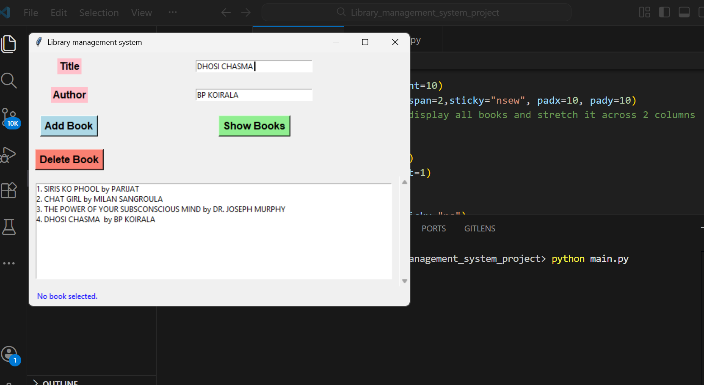

Library Management System (Python + Tkinter + SQLite)  
A simple desktop application to manage books in a library. Built with Python’s Tkinter for the GUI and SQLite for the database.

Features:

Add new books with title and author

Display all books in a scrollable list

Delete selected books from the database

Auto-refresh list after each operation

User-friendly interface with improved layout, fonts, and colors

Status bar for feedback messages

Tech Stack:

Python 3

Tkinter (GUI)

SQLite (Database)

## Screenshots

